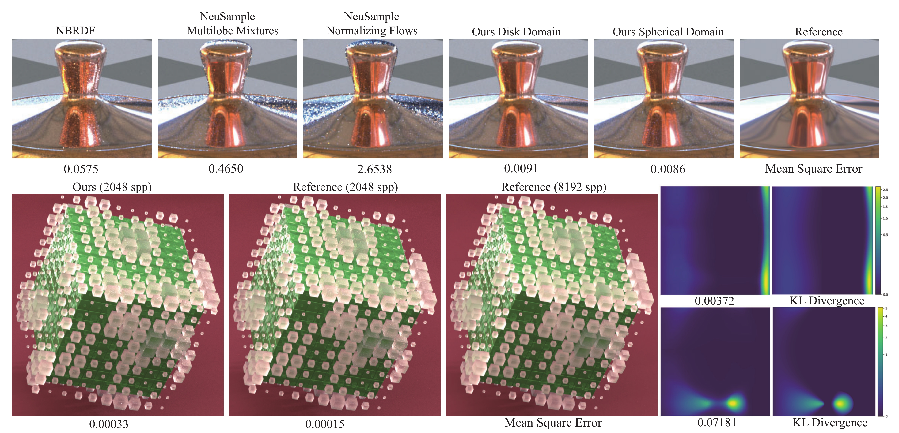

## BSDF importance sampling using a diffusion model

Official Implementation for *BSDF importance sampling using a diffusion model*

*SIGGRAPH Asia 2024 (conference track)*

[Project Page](https://fzy28.github.io/BSDF_diffusion_sampling_web/) | [Paper Link](https://fzy28.github.io/BSDF_diffusion_sampling_web/main.pdf)

### About

Currently, I've simply cleaned up my old experimental code and placed it here. I plan to write a cleaner version with comprehensive instructions and annotations later(It now seems to be much longer than I thought, sorry I am busy with my PhD applicaition ｡ﾟ･ (>﹏<) ･ﾟ｡) 

sorrysorrysorry I am too lazy... Likely I will have time to do this around the beginning of next year Feb.  

However, the code provided here should already be functional and capable of reproducing the results presented in our paper.

If you'd like to use or compare with our model, or if you have any questions, please don't hesitate to email me! 

### A cool 1D demo – highly recommended to check it out!

For guys interested in our work, we **recommend** checking our [1D toy case demo](https://colab.research.google.com/drive/1UENmBsCueM-yPOfaS1YqQ6lC9BPxALwV?usp=sharing). 

This simple demo effectively showcases the key concepts and should be enjoyable to go through. Plus, it’s quick and won’t take much of your time!
